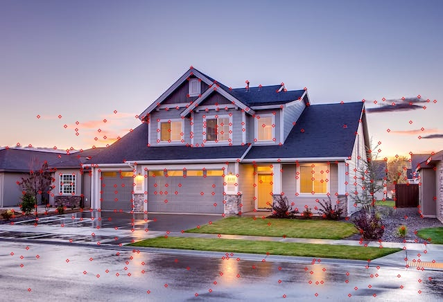
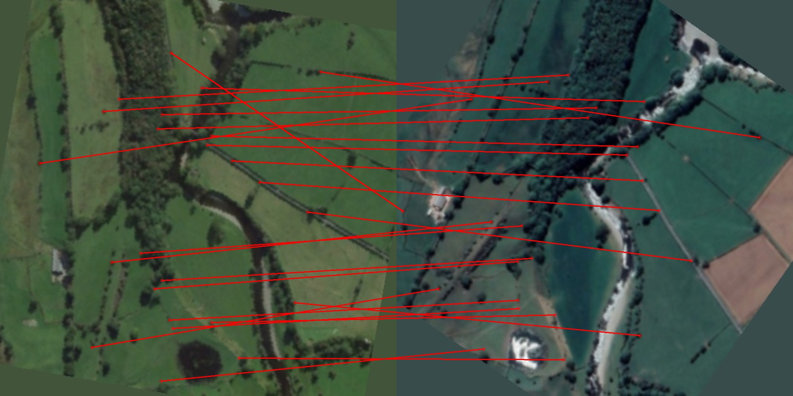

# Setting up this repository
To set up repository the only thing you will need is:
1) The first step is to clone the repository and cd to it.
2) Next create virtual env or activate some of your conda envs. Run `pip install -r requirements.txt`
3) From the google drive copy weights from the folder "Task 2/weights" to the weights folder.

That's it! You're ready to go!

# Inferencing
There are two different scripts: one for inferencing keypoints on the image and the other performs entire matching of the keypoints.

Also I have to admit that even finding keypoints on satellite imagenary takes enormous amount of RAM or GPU RAM, unfortunately I at some point I had to implement algorithm, which creates temporary files containing all information about current inference. Although it is needed for satellite imagery only, so this type of inference is enabled with option `--type` in all inference scripts.

## Inferencing Keypoints
For inferencing keypoint there is script named `super_point_inference.py`. It contains the following CLI options:
```
optional arguments:
  -h, --help            show this help message and exit
  -w WEIGHT_PATH, --weight-path WEIGHT_PATH
                        Path to the pretrained SuperPoint model.
  -i INPUT, --input INPUT
                        Path to the image to inference on.
  --intermediate-size INTERMEDIATE_SIZE
                        Size of the image that is being sended to the input of the model.
  -o OUTPUT, --output OUTPUT
                        Name of the output file (file that contain predicitons.)
  -d DEVICE, --device DEVICE
                        On which device to inference.
  --type TYPE           Type of the inference (whether to use temp-backed inference.)
```

Example of inference on regular image: 
```
$ python super_point_inference.py -i examples/example_0/house.jpg -o house_keypoints.jpg
```

The output is like this:



Example of inference on satellite image (can take some time):
```
$ python super_point_inference.py -i examples/examples_0/sattelite.jpg -o satellite_keypoints.jpg
```


## Inference Matching (Actual point of the task)
For inferencing keypoint there is script named `inference.py`. It contains the following CLI options:
```
options:
  -h, --help            show this help message and exit
  --first-image FIRST_IMAGE
                        Path to the first image.
  --second-image SECOND_IMAGE
                        Path to the second image.
  --threshold THRESHOLD
                        A minimal score to consider match eligible.
  -s SCALE, --scale SCALE
                        Scale the images.
  -t TYPE, --type TYPE  Tells which matcher to use: "satellite" or "base".
```

Unfortunately, due to the lack of time, I could not implement matcher for the satellite images (I mean for those 8160x8160-like). Only small images are currently supported.

Example of inference on regular images:
```
$ python inference.py --first-image examples/example_1/1.jpg --second-image examples/example_1/1_aug_0.jpg -s 2
```

This produces the output image with connected homogenius dots:


Another example is:
```
$ python inference.py --first-image examples/example_2/0_aug_0.jpg --second-image examples/example_2/0_aug_1.jpg -s 2 --threshold 0.95
```



# Training/finetuning
Unfortunately, there was no training and only pretrained models are being used. However, there are my thoughts on training and how to implement it placed in 'Enhancements.pdf'. There is also a script named 'train.py' which is currently with a lot of bugs, as well as implementation of MagicPoint architecture (which also needs to be fixed).

In a nutshell, it is obvious, that there must be a finetuning on images from satellites due to the difference in camera angle, perspective and also size of the objects on the scene. For preparing dataset I would use trained MagicPoint to generate dataset for finetuning SuperPoint on satellite data. However, there is a big questing do we need to finetune SuperGlue? 

*My guess is we do not need to fine-tune SuperGlue*, because SuperGlue rather operates on how keypoints interact with each other in a way, that they are homogenius, so that means SuperPoint will not know whether those points were from satellite data or from any other dataset (or the difference will be small enough and more depends on how high accuracy must be.)

*However we need to finetune SuperPoint*, because scene has changed, and from what I saw accuracy of SuperPoint drastically deteriorated on the satellite images. Maybe for the naked eye it is not noticable, but it is noticable for the SuperGlue.
# Datasets
Datasets for MagicPoint:
- **Synthetic Shapes** (was generated beyond this repository).

Datasets for SuperPoint:
- **Satellite GEP**. Was generated from images of Earth surface available in Google Earth Pro. Around 100 images of 8000 by 8000 pixels. Each of them covers approximately 10x10 km square of the Earth surface. Most of the images are from Summer, Spring and Autumn (Google for some unknown reason don't like images with snow.) 


# Credits
Most of the algorithms I implemented myself, but some of them I took from the repositories below:

- Synthetic shapes dataset was used from repository [Super Point](https://github.com/rpautrat/SuperPoint/tree/master) and was not generated due to the tight deadlines.
- Prettrained weights and implementations of the models were used from the repository [SuperGluePretrainedNetwork](https://github.com/magicleap/SuperGluePretrainedNetwork/tree/master). 